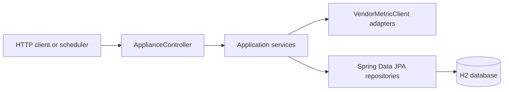
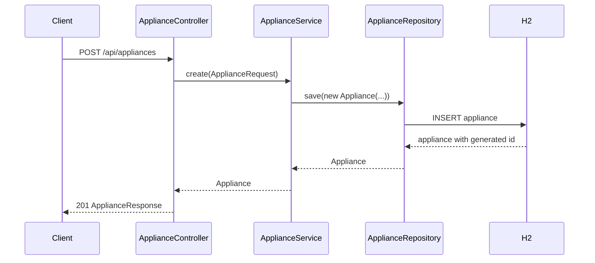
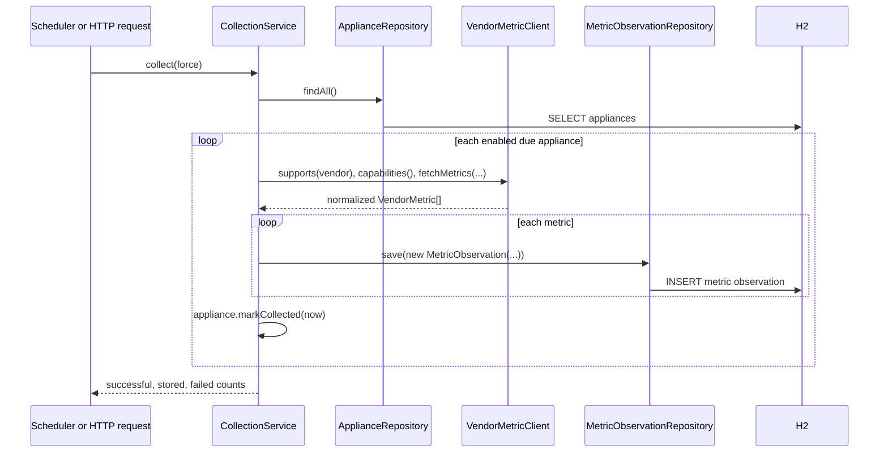
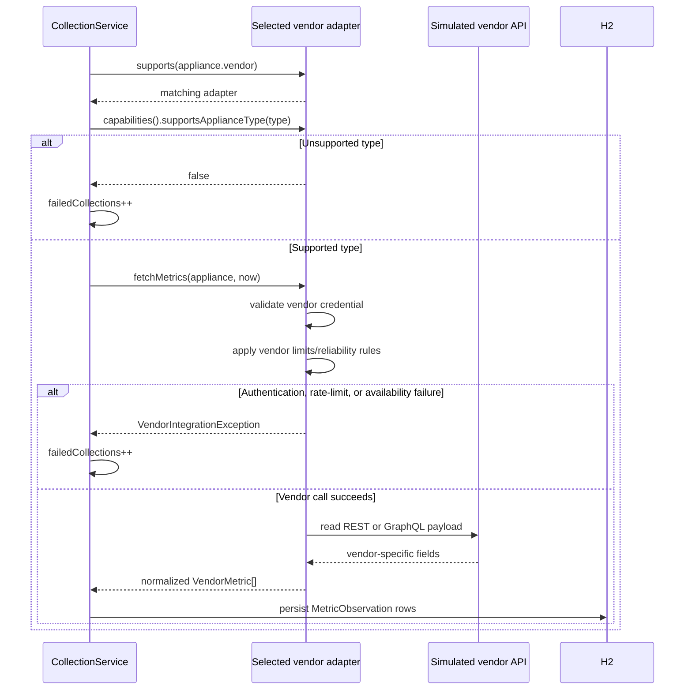
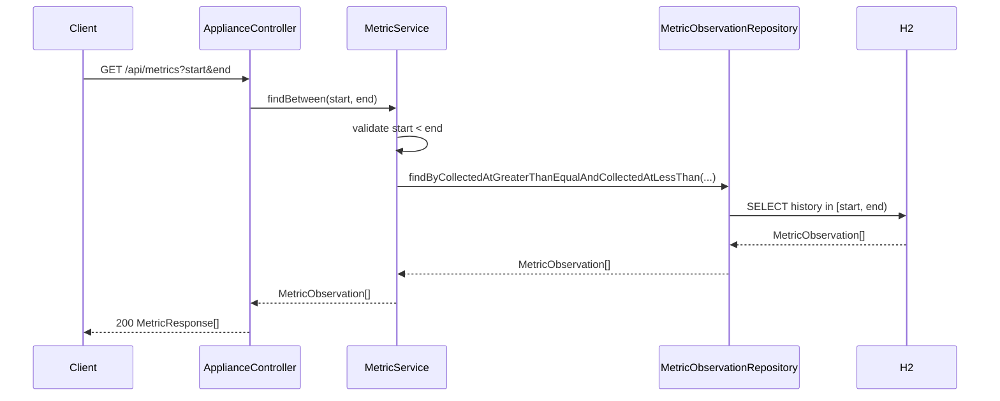

# Code Walkthrough

This guide traces the runtime path for the main review scenarios. It explains which Java methods Spring invokes, what each method does, and where data is persisted or read.

## Runtime Layers



- The controller translates HTTP requests into service calls.
- Services own workflow rules such as validation, due-interval checks, vendor selection, and reporting.
- Vendor adapters convert vendor-specific data into common `VendorMetric` values.
- Repositories are Spring Data JPA interfaces. Spring creates their implementations and issues database queries through Hibernate.

## Local and Deployment Configuration

The application starts locally with no required environment variables. [application.yml](src/main/resources/application.yml) defaults to an in-memory H2 database, local simulated vendor credentials, H2 console enabled, and a five-second scheduler delay. Actuator health is available at `GET /actuator/health`.

The same file uses environment placeholders for deployment. Set `DATABASE_URL`, `DATABASE_USERNAME`, `DATABASE_PASSWORD`, `JPA_DDL_AUTO`, `H2_CONSOLE_ENABLED`, `ACME_BEARER_TOKEN`, `NORTHWIND_API_KEY`, and scheduler/vendor-limit settings in the environment. PostgreSQL JDBC support is included in [pom.xml](pom.xml); use `JPA_DDL_AUTO=validate` with versioned migrations and `H2_CONSOLE_ENABLED=false` outside local review.

`spring.jpa.open-in-view=false` prevents HTTP responses from depending on a persistence session that outlives the service call. The historical query explicitly fetches its source appliance, so metric response mapping and report aggregation have the data they need without lazy-loading outside the persistence boundary.

## 1. Add an Appliance

### Request

```http
POST /api/appliances
Content-Type: application/json

{
  "name": "Kitchen refrigerator",
  "type": "refrigerator",
  "vendor": "acme",
  "collectionIntervalSeconds": 60
}
```

### Call Sequence



### Methods Invoked

1. Spring deserializes the JSON body into [`ApiModels.ApplianceRequest`](src/main/java/com/example/iot/api/ApiModels.java#L11). Bean Validation checks that `name`, `type`, and `vendor` are not blank and that `collectionIntervalSeconds >= 1`.
2. Spring invokes [`ApplianceController.create`](src/main/java/com/example/iot/api/ApplianceController.java#L30) because it is mapped with `@PostMapping("/api/appliances")`. The `@Valid` annotation triggers the request validation above.
3. The controller calls [`ApplianceService.create`](src/main/java/com/example/iot/service/ApplianceService.java#L24).
4. `ApplianceService.create` constructs [`Appliance`](src/main/java/com/example/iot/domain/Appliance.java#L19) with the name, type, vendor, and interval, then calls `repository.save(...)`.
5. [`ApplianceRepository`](src/main/java/com/example/iot/repository/ApplianceRepository.java#L6) inherits `save` from `JpaRepository`. Spring Data JPA and Hibernate insert the new appliance row into H2 and return the entity with its generated ID.
6. The controller converts the entity with [`ApplianceResponse.from`](src/main/java/com/example/iot/api/ApiModels.java#L14) and sends `201 Created`. The supplied `enabled` field is intentionally not used during creation; a new `Appliance` starts enabled by default.

### Stored State

The `Appliance` entity fields are mapped by JPA in [`Appliance.java`](src/main/java/com/example/iot/domain/Appliance.java#L6-L13): identity, name, type, vendor, collection interval, enabled flag, and `lastCollectedAt`. `lastCollectedAt` is `null` until the first successful collection.

## 2. Observe and Store Appliance Metrics

Collection can start in either way:

- **Scheduled:** Spring calls [`CollectionService.collectDueAppliances`](src/main/java/com/example/iot/service/CollectionService.java#L26) every configured five seconds. It calls `collect(false)`, so an appliance must be enabled and due.
- **Manual review:** `POST /api/collections/run` invokes [`ApplianceController.collect`](src/main/java/com/example/iot/api/ApplianceController.java#L39), which calls `collect(true)`. `true` bypasses only the interval check; disabled appliances are still skipped.

### Call Sequence



### Methods Invoked

1. [`CollectionService.collect`](src/main/java/com/example/iot/service/CollectionService.java#L29) starts one transactional collection run and records one `Instant now` shared by all observations in that run.
2. It calls `appliances.findAll()` to load all registered `Appliance` entities. This uses the inherited JPA repository method from [`ApplianceRepository`](src/main/java/com/example/iot/repository/ApplianceRepository.java#L6).
3. For each appliance, the method calculates `due` from `lastCollectedAt`, `now`, and `collectionIntervalSeconds` at [CollectionService.java](src/main/java/com/example/iot/service/CollectionService.java#L32). It skips disabled appliances and, for scheduled runs, appliances not yet due.
4. [`CollectionService.clientFor`](src/main/java/com/example/iot/service/CollectionService.java#L50) chooses the `VendorMetricClient` whose `supports(appliance.getVendor())` matches the registered vendor.
5. The collection service calls `client.capabilities().supportsApplianceType(...)` at [CollectionService.java](src/main/java/com/example/iot/service/CollectionService.java#L36). An unsupported vendor/type pair is counted as a failed collection and no observation is saved.
6. The adapter’s `fetchMetrics` normalizes its source contract to `VendorMetric` values:
    - [`AcmeRestVendorMetricClient.fetchMetrics`](src/main/java/com/example/iot/vendor/AcmeRestVendorMetricClient.java#L26) checks the bearer token, reads REST-style fields, and maps `temp_celsius` and `watts` to `temperature` and `power`.
    - [`NorthwindGraphQlVendorMetricClient.fetchMetrics`](src/main/java/com/example/iot/vendor/NorthwindGraphQlVendorMetricClient.java#L33) checks the API key, applies rate limiting and optional availability failure simulation, then maps GraphQL-style `completion` and `wattsNow` to `cycle_progress` and `power`.
    - [`MockVendorMetricClient.fetchMetrics`](src/main/java/com/example/iot/vendor/MockVendorMetricClient.java#L19) supplies deterministic local values for other vendor names and appliance types.
7. For each normalized `VendorMetric`, [`CollectionService.collect`](src/main/java/com/example/iot/service/CollectionService.java#L37-L39) constructs a [`MetricObservation`](src/main/java/com/example/iot/domain/MetricObservation.java#L18) and calls `metrics.save(...)`.
8. [`MetricObservationRepository`](src/main/java/com/example/iot/repository/MetricObservationRepository.java#L8) inherits `save` from `JpaRepository`, so JPA inserts one historical row per metric with the appliance relationship, timestamp, normalized name, value, and unit.
9. After every metric is stored successfully, [`Appliance.markCollected`](src/main/java/com/example/iot/domain/Appliance.java#L42) updates `lastCollectedAt`; Hibernate writes that changed entity when the transaction completes.
10. A vendor authentication, capability, rate-limit, or temporary-availability error is caught per appliance at [CollectionService.java](src/main/java/com/example/iot/service/CollectionService.java#L42-L44). The service increments `failedCollections` and continues to the next appliance.
11. Manual collection returns [`CollectionResponse`](src/main/java/com/example/iot/api/ApiModels.java#L20) with `appliancesCollected`, `metricsStored`, and `failedCollections`.

### Vendor Authentication, Capabilities, Rate Limits, and Reliability

These checks happen **inside a collection call**, after `CollectionService` selects an adapter for an enabled appliance and before any `MetricObservation` is persisted. They model authentication with the appliance vendor, not authentication of the platform API caller.



| Concern | When it runs | Code and outcome |
|---|---|---|
| Adapter selection | Before metric retrieval for every appliance | [`CollectionService.clientFor`](src/main/java/com/example/iot/service/CollectionService.java#L50) filters injected adapters by `supports(appliance.getVendor())`. `acme` chooses the ACME adapter; `northwind` chooses Northwind; all other vendor names use the generic mock. |
| Capabilities | After adapter selection and before `fetchMetrics` | [`CollectionService.collect`](src/main/java/com/example/iot/service/CollectionService.java#L35-L36) asks `VendorCapabilities.supportsApplianceType`. ACME permits refrigerators and air conditioners; Northwind permits washers, dryers, and televisions. A false result throws `IllegalArgumentException`, increments `failedCollections`, and writes no metrics. |
| ACME authentication | First instruction inside ACME `fetchMetrics` | [`AcmeRestVendorMetricClient.fetchMetrics`](src/main/java/com/example/iot/vendor/AcmeRestVendorMetricClient.java#L26-L29) checks `vendors.acme.bearer-token`. A blank value throws `VendorIntegrationException`; a configured token allows REST payload retrieval and normalization. |
| Northwind authentication | First instruction inside Northwind `fetchMetrics` | [`NorthwindGraphQlVendorMetricClient.fetchMetrics`](src/main/java/com/example/iot/vendor/NorthwindGraphQlVendorMetricClient.java#L33-L38) checks `vendors.northwind.api-key`. A blank value throws `VendorIntegrationException` before rate-limit accounting or metric retrieval. |
| Rate limit | After Northwind authentication and before the payload is produced | Northwind calls [`enforceRateLimit`](src/main/java/com/example/iot/vendor/NorthwindGraphQlVendorMetricClient.java#L42-L45). It resets the counter when the one-minute window expires, increments the current window count, and throws when the configured `max-requests-per-minute` is exceeded. |
| Reliability simulation | After Northwind authentication and rate-limit validation | [`NorthwindGraphQlVendorMetricClient.fetchMetrics`](src/main/java/com/example/iot/vendor/NorthwindGraphQlVendorMetricClient.java#L35-L36) throws a temporary-availability `VendorIntegrationException` every configured $n$ requests when `fail-every-requests` is greater than zero. |
| Failure isolation | Around vendor adapter selection, capability validation, and metric retrieval | [`CollectionService.collect`](src/main/java/com/example/iot/service/CollectionService.java) catches only typed `VendorIntegrationException` failures for the current appliance, increments `failedCollections`, and continues its loop. The appliance's `lastCollectedAt` is not advanced, so a later scheduled run can retry it. |

`VendorIntegrationException` has one of four categories: `AUTHENTICATION`, `CAPABILITY`, `RATE_LIMIT`, or `TEMPORARY_UNAVAILABLE`. The collection warning log includes that category with the appliance ID, vendor, type, and message. Importantly, the collection catch handles only `VendorIntegrationException`: a database write or unexpected internal failure propagates and fails the transaction rather than being silently counted as a vendor failure.

The local simulation values are in [application.yml](src/main/resources/application.yml). They are deliberately non-secret development defaults. In production, the same adapter boundary would retrieve credentials from a secret manager and make real HTTP calls, while preserving the normalized `VendorMetric` output used by persistence and reports.

### Stored Metric Record

[`MetricObservation`](src/main/java/com/example/iot/domain/MetricObservation.java#L6-L12) is the historical table model. Every record contains:

| Field | Meaning |
|---|---|
| `appliance` | Required many-to-one reference to the source appliance. |
| `collectedAt` | Time selected at the start of the collection run. |
| `metricName` | Normalized name, such as `temperature`, `power`, or `cycle_progress`. |
| `metricValue` | Numeric value from the adapter. |
| `unit` | Normalized unit, such as `C`, `W`, `L`, or `percent`. |

## 3. Read Historical Metrics

### Request

```http
GET /api/metrics?start=2026-08-19T00:00:00Z&end=2026-08-20T00:00:00Z
```

### Call Sequence



### Methods Invoked

1. Spring converts the ISO-8601 query parameters to `Instant` values and invokes [`ApplianceController.metrics`](src/main/java/com/example/iot/api/ApplianceController.java#L42).
2. The controller calls [`MetricService.findBetween`](src/main/java/com/example/iot/service/MetricService.java#L18).
3. The service rejects an empty or reversed range with `IllegalArgumentException` unless $start < end$.
4. The service calls [`MetricObservationRepository.findByCollectedAtGreaterThanEqualAndCollectedAtLessThan`](src/main/java/com/example/iot/repository/MetricObservationRepository.java#L12). Its JPQL query applies the half-open time range and `join fetch`es the source appliance, so response mapping does not rely on Open Session in View.
5. The query uses the half-open range $[start, end)$: observations at `start` are included; observations at `end` are excluded.
6. The controller maps each entity with [`MetricResponse.from`](src/main/java/com/example/iot/api/ApiModels.java#L18) and returns `200 OK` with raw historical observations.

## 4. Create a Custom-Range Report

### Request

```http
GET /api/reports?start=2026-08-19T00:00:00Z&end=2026-08-20T00:00:00Z
```

### Methods Invoked

1. [`ApplianceController.report`](src/main/java/com/example/iot/api/ApplianceController.java#L48) receives `start` and `end` and calls [`ReportService.generate`](src/main/java/com/example/iot/service/ReportService.java#L19).
2. `generate` validates $start < end$ and invokes the same repository range method used by raw-history reads: [`MetricObservationRepository.findByCollectedAtGreaterThanEqualAndCollectedAtLessThan`](src/main/java/com/example/iot/repository/MetricObservationRepository.java#L10).
3. The service groups each stored sample by appliance ID, metric name, and unit at [ReportService.java](src/main/java/com/example/iot/service/ReportService.java#L21-L22). This keeps each appliance's temperature, power, and other metrics separate.
4. For each group, [`ReportService.summarize`](src/main/java/com/example/iot/service/ReportService.java#L27) uses `DoubleSummaryStatistics` to calculate sample count, minimum, maximum, and average.
5. `generate` returns `ReportResponse`; Spring serializes it as `200 OK`.

## 5. Create a Daily Report

### Request

```http
GET /api/reports/daily/2026-08-19
```

1. [`ApplianceController.daily`](src/main/java/com/example/iot/api/ApplianceController.java#L45) parses the `LocalDate` and converts it to a UTC range from midnight on the requested day to midnight on the following day.
2. It calls [`ReportService.generate`](src/main/java/com/example/iot/service/ReportService.java#L19), so daily reporting uses the same grouping, statistics, and half-open range behavior as a custom report.

## Exception Paths

- Invalid JSON fields or a non-positive interval fail Bean Validation before the controller invokes the service.
- Unknown appliance updates and deletes call [`ApplianceService.find`](src/main/java/com/example/iot/service/ApplianceService.java#L21), which throws `NoSuchElementException`; [`ApiExceptionHandler`](src/main/java/com/example/iot/api/ApiExceptionHandler.java) maps it to `404`.
- Empty or reversed metric/report ranges throw `IllegalArgumentException`; `ApiExceptionHandler` maps it to `400`.
- Typed vendor failures are deliberately contained inside `CollectionService.collect`; they appear in `failedCollections` rather than failing the entire collection request and are logged with appliance ID, vendor, type, failure category, and message. Persistence and unexpected internal failures are not contained: they propagate so transaction problems remain visible.

## Where To Start While Reviewing

1. Start with [`ApplianceController`](src/main/java/com/example/iot/api/ApplianceController.java), the API entry point.
2. Follow the matching service: [`ApplianceService`](src/main/java/com/example/iot/service/ApplianceService.java), [`CollectionService`](src/main/java/com/example/iot/service/CollectionService.java), [`MetricService`](src/main/java/com/example/iot/service/MetricService.java), or [`ReportService`](src/main/java/com/example/iot/service/ReportService.java).
3. Follow repository calls into [`ApplianceRepository`](src/main/java/com/example/iot/repository/ApplianceRepository.java) or [`MetricObservationRepository`](src/main/java/com/example/iot/repository/MetricObservationRepository.java).
4. For collection, follow the selected adapter under [`src/main/java/com/example/iot/vendor`](src/main/java/com/example/iot/vendor).
