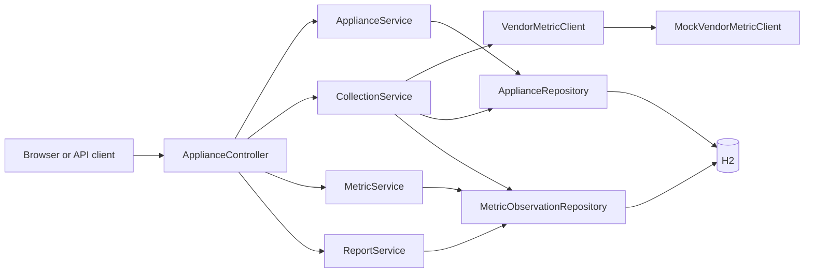
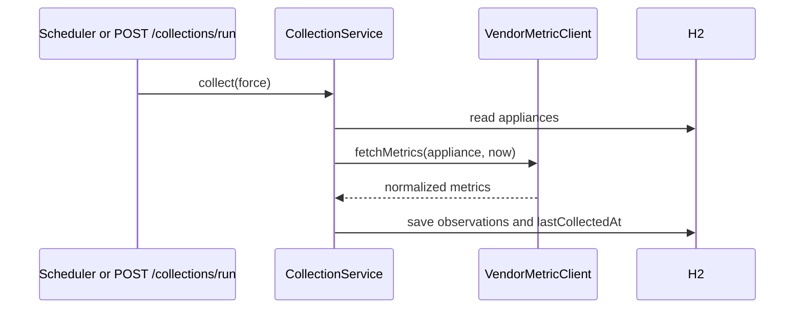

# IoT Appliance Platform: Design and Operating Guide

## Purpose

This service provides one REST API for household appliances that may originate from different vendors. It registers appliance configuration, periodically collects normalized vendor data, retains the raw history, and provides daily or custom time-range reports.

The project intentionally uses a local H2 database and deterministic mocked vendor behavior. It is runnable without accounts, appliances, cloud resources, or credentials.

## Prerequisites

| Requirement | Version | Check |
|---|---:|---|
| Java | 21 | `java --version` |
| Maven | 3.9+ | `mvn --version` |

On macOS with Homebrew, install the prerequisites with:

```bash
brew install openjdk@21 maven
```

Set Java 21 for the terminal session:

```bash
export JAVA_HOME="/opt/homebrew/opt/openjdk@21"
export PATH="$JAVA_HOME/bin:$PATH"
```

## Start, Stop, and Test

From the repository root:

```bash
mvn spring-boot:run
```

Spring Boot listens on `http://localhost:8080`. Open `http://localhost:8080/` in a browser to get the JSON API index. Stop the process with `Ctrl+C`.

Run the integration suite without starting a separate server:

```bash
mvn test
```

The suite verifies root discovery, registration-to-report collection flow, and `400`/`404` error responses.

## Configuration

`src/main/resources/application.yml` configures the application:

| Property | Default | Meaning |
|---|---:|---|
| `spring.datasource.url` | `jdbc:h2:mem:appliances;DB_CLOSE_DELAY=-1;MODE=PostgreSQL` | In-memory database kept alive while the application runs. |
| `spring.jpa.hibernate.ddl-auto` | `update` | Creates or updates local schema from JPA entities. |
| `spring.h2.console.enabled` | `true` | Enables the local H2 console at `/h2-console`. |
| `collection.scheduler-delay-ms` | `5000` | How often the scheduler checks for appliances that are due. |

The H2 console URL is `http://localhost:8080/h2-console`. Use JDBC URL `jdbc:h2:mem:appliances`, user `sa`, and an empty password. The database is intentionally erased when the process stops.

## End-to-End Example

Set a base URL and use ISO-8601 UTC timestamps in all time-range requests:

```bash
BASE_URL=http://localhost:8080
START=$(date -u -v-5M +%Y-%m-%dT%H:%M:%SZ)
END=$(date -u -v+5M +%Y-%m-%dT%H:%M:%SZ)
```

On Linux, replace the `date` commands with:

```bash
START=$(date -u -d '5 minutes ago' +%Y-%m-%dT%H:%M:%SZ)
END=$(date -u -d '5 minutes' +%Y-%m-%dT%H:%M:%SZ)
```

### 1. Discover the API

```bash
curl "$BASE_URL/"
```

Expected shape:

```json
{
  "service": "IoT Appliance Platform",
  "endpoints": {
    "appliances": "/api/appliances",
    "collect": "/api/collections/run"
  }
}
```

### 2. Add appliances

Register a refrigerator. `name`, `type`, `vendor`, and a positive `collectionIntervalSeconds` are required. `enabled` is optional on creation and defaults to `true`.

```bash
curl -X POST "$BASE_URL/api/appliances" \
  -H 'Content-Type: application/json' \
  -d '{
    "name": "Kitchen refrigerator",
    "type": "refrigerator",
    "vendor": "acme",
    "collectionIntervalSeconds": 60
  }'
```

Example response:

```json
{
  "id": 1,
  "name": "Kitchen refrigerator",
  "type": "refrigerator",
  "vendor": "acme",
  "collectionIntervalSeconds": 60,
  "enabled": true,
  "lastCollectedAt": null
}
```

Register an air conditioner:

```bash
curl -X POST "$BASE_URL/api/appliances" \
  -H 'Content-Type: application/json' \
  -d '{"name":"Bedroom AC","type":"air_conditioner","vendor":"northwind","collectionIntervalSeconds":30}'
```

Supported mocked types are `refrigerator`/`fridge`, `air_conditioner`/`ac`, and any other type. Unknown types receive generic `power` and `status` samples.

### 3. List, modify, or remove appliances

```bash
curl "$BASE_URL/api/appliances"

curl -X PUT "$BASE_URL/api/appliances/1" \
  -H 'Content-Type: application/json' \
  -d '{"name":"Kitchen refrigerator","type":"refrigerator","vendor":"acme","collectionIntervalSeconds":120,"enabled":false}'

curl -X DELETE "$BASE_URL/api/appliances/1"
```

`PUT` replaces the supplied configuration. Set `enabled` to `false` to stop scheduled and manual collection for an appliance. Deleting an unknown appliance returns `404`.

### 4. Collect metrics immediately

The scheduler checks every five seconds, but an appliance is collected only after its own configured interval elapses. Trigger immediate collection for a reproducible review flow:

```bash
curl -X POST "$BASE_URL/api/collections/run"
```

Example response:

```json
{
  "appliancesCollected": 2,
  "metricsStored": 4
}
```

Each enabled refrigerator records `temperature` in `C` and `door_open` as `0` or `1` in `boolean`. Each enabled AC records `temperature` in `C` and `power` in `W`.

### 5. Get raw time-bounded metric history

The metric endpoint uses a half-open interval: it includes samples where $start \le collectedAt < end$. This avoids counting a boundary sample twice in adjacent requests.

```bash
curl --get "$BASE_URL/api/metrics" \
  --data-urlencode "start=$START" \
  --data-urlencode "end=$END"
```

Example response:

```json
[
  {
    "applianceId": 1,
    "collectedAt": "2026-08-18T16:06:00Z",
    "metricName": "temperature",
    "value": 2.4,
    "unit": "C"
  }
]
```

### 6. Generate a custom-range report

The report endpoint aggregates raw data by appliance, metric name, and unit. Each row exposes the sample count, minimum, maximum, and average.

```bash
curl --get "$BASE_URL/api/reports" \
  --data-urlencode "start=$START" \
  --data-urlencode "end=$END"
```

Example response fragment:

```json
{
  "start": "2026-08-18T16:00:00Z",
  "end": "2026-08-18T16:10:00Z",
  "metrics": [
    {
      "applianceId": 1,
      "applianceName": "Kitchen refrigerator",
      "metricName": "temperature",
      "unit": "C",
      "samples": 3,
      "minimum": 2.1,
      "maximum": 2.8,
      "average": 2.5
    }
  ]
}
```

### 7. Generate a daily report

Daily reports use midnight-to-midnight UTC, not the server's local time zone:

```bash
curl "$BASE_URL/api/reports/daily/2026-08-18"
```

## HTTP API Reference

| Method and path | Purpose | Success |
|---|---|---:|
| `GET /` | Service name and route discovery. | `200` |
| `GET /api/appliances` | List configured appliances. | `200` |
| `POST /api/appliances` | Create an appliance. | `201` |
| `PUT /api/appliances/{id}` | Replace appliance configuration. | `200` |
| `DELETE /api/appliances/{id}` | Remove an appliance. | `204` |
| `POST /api/collections/run` | Force due-interval bypass for enabled appliances. | `200` |
| `GET /api/metrics?start&end` | Retrieve raw observations in `[start,end)`. | `200` |
| `GET /api/reports?start&end` | Aggregate observations in `[start,end)`. | `200` |
| `GET /api/reports/daily/{YYYY-MM-DD}` | Aggregate one UTC calendar day. | `200` |

Invalid fields are rejected by Bean Validation with `400`. An invalid or empty time range returns `400` with `{"error":"start must be before end"}`. Missing appliance IDs return `404` with an error message.

## Architecture



Collection flow:



## Data Model

`Appliance` is the configuration and scheduling state:

| Field | Meaning |
|---|---|
| `id` | Generated primary key. |
| `name`, `type`, `vendor` | Client-supplied appliance identity and integration routing data. |
| `collectionIntervalSeconds` | Minimum automatic polling gap. |
| `enabled` | Blocks any collection when false. |
| `lastCollectedAt` | Last successful collection timestamp. |

`MetricObservation` is immutable historical data in practice:

| Field | Meaning |
|---|---|
| `id` | Generated primary key. |
| `appliance` | Required many-to-one relationship to its source. |
| `collectedAt` | Timestamp selected by collection orchestration. |
| `metricName`, `metricValue`, `unit` | Normalized vendor data. |

## Complete Source Walkthrough

This walkthrough explains every handwritten source element. Java record component accessors, constructors, `equals`, `hashCode`, and `toString` are compiler-generated and therefore do not appear as handwritten methods.

### Bootstrap and configuration

- `AppliancePlatformApplication.java`: `@SpringBootApplication` enables component discovery, auto-configuration, and application startup. `@EnableScheduling` activates `@Scheduled` collection. `main` passes the application class and process arguments to `SpringApplication.run`.
- `application.yml`: selects in-memory H2, asks Hibernate to derive tables from the two entities, enables the development-only H2 console, and sets the scheduler's five-second check interval.
- `pom.xml`: declares Java 21; web, validation, JPA, and test Spring Boot starters; H2 at runtime; and the Spring Boot Maven plugin for `mvn spring-boot:run` and packaging.

### API layer

- `ApiModels.java`: groups immutable request/response records. `ApplianceRequest` declares Bean Validation: blank names, types, or vendors and intervals less than one are invalid. `ApplianceResponse.from` maps an entity to safe response fields. `MetricResponse.from` maps a stored observation. `CollectionResponse` communicates work performed. `MetricSummary` is one report aggregate. `ReportResponse` contains the queried range and summary rows.
- `ApplianceController.java`: exposes HTTP routes only. Constructor injection supplies business services. `index` returns browser-friendly route discovery. `list`, `create`, `update`, and `delete` delegate appliance lifecycle work. `collect` triggers collection with interval bypass. `metrics` asks `MetricService` for raw range data and maps it to response records. `daily` converts a date to a UTC 24-hour range. `report` delegates arbitrary-range aggregation.
- `ApiExceptionHandler.java`: `@RestControllerAdvice` handles expected application errors for every controller. `notFound` converts `NoSuchElementException` to `404`; `invalidRequest` converts invalid business arguments to `400`. Both serialize the exact message as JSON under `error`.

### Domain and persistence layer

- `Appliance.java`: is the JPA appliance table. Its no-argument constructor permits Hibernate hydration. Its public constructor initializes a new managed appliance. Getters expose persistent state. `update` replaces mutable configuration. `markCollected` updates the timestamp after observations are saved.
- `MetricObservation.java`: is the JPA history table. It stores one metric sample tied to its appliance. The protected constructor serves Hibernate; the public constructor sets every required value; getters make its fields available to API mapping and reporting.
- `ApplianceRepository.java`: inherits standard JPA create, read, update, and delete operations for `Appliance` from `JpaRepository`.
- `MetricObservationRepository.java`: inherits standard JPA operations and declares `findByCollectedAtGreaterThanEqualAndCollectedAtLessThan`. Spring Data derives SQL from that name, returning the half-open timestamp range.

### Application services

- `ApplianceService.java`: owns appliance lifecycle rules. `findAll` reads every appliance. `find` reads one or throws `NoSuchElementException` for the exception advice. `create` transforms the API request into an entity. `update` loads then modifies an existing entity; an omitted enabled value means true. `delete` confirms existence before removal.
- `MetricService.java`: owns raw historical reads. `findBetween` validates the range before executing the repository query. `@Transactional(readOnly = true)` documents that it does not mutate data and permits database optimizations.
- `CollectionService.java`: owns scheduling and persistence orchestration, not vendor implementation. `collectDueAppliances` is called by Spring at the configured fixed delay. `collect` checks enabled state and either due interval or force flag, asks the client interface for metrics, stores every observation, advances `lastCollectedAt`, and returns counts. It is transactional so one collection execution succeeds or rolls back together.
- `ReportService.java`: owns aggregation. `generate` rejects invalid ranges, loads historical samples, groups by appliance ID plus metric and unit, then builds one summary per group. `summarize` calculates count, min, max, and average with `DoubleSummaryStatistics`.

### Vendor extension point

- `VendorMetric.java`: is a normalized value object with `name`, numeric `value`, and `unit`.
- `VendorMetricClient.java`: is the abstraction used by collection. A real vendor implementation can authenticate, apply rate limits, map vendor field names, and return `VendorMetric` values without changing `CollectionService`.
- `MockVendorMetricClient.java`: is the current Spring component implementation. `fetchMetrics` derives a repeatable small variation from appliance ID and timestamp and returns metrics selected by appliance type. It makes the entire review workflow locally testable.

### Tests

- `ApplianceWorkflowIntegrationTest.java`: starts a real Spring application context and injects `MockMvc`. `rootReturnsApiDiscovery` checks browser discovery. `applianceCanBeRegisteredCollectedAndReported` verifies registration, forced collection, persistence, and aggregation. `invalidRequestsReturnClientErrors` verifies the `404` and `400` contract.

## SOLID Review and Changes

| Principle | Assessment | Result |
|---|---|---|
| Single responsibility | Controller, lifecycle, query, collection, reporting, and vendor behavior now have distinct owners. | Fixed: vendor behavior moved from `CollectionService` into `MockVendorMetricClient`; metric reads moved from controller into `MetricService`. |
| Open/closed | Collection should accept new vendor integrations without source changes. | Fixed: add a `VendorMetricClient` implementation rather than editing orchestration. |
| Liskov substitution | Any client implementing `VendorMetricClient` can replace the mock client while returning the declared normalized metric type. | Satisfied. |
| Interface segregation | The vendor boundary asks only for `fetchMetrics`; callers do not depend on authentication or transport operations they do not need. | Satisfied. |
| Dependency inversion | High-level collection depends on `VendorMetricClient`, not `MockVendorMetricClient`; HTTP handlers depend on services, not JPA repositories. | Fixed. |

Also fixed during review: missing appliance IDs now return `404`, invalid date ranges return `400`, and integration coverage asserts both behaviors.

## Assumptions and Production Next Steps

The assignment deliberately omits authentication, tenant isolation, persistent production database configuration, vendor credential storage, retries, backoff, rate limiting, distributed scheduling locks, pagination, and observability. In production, implement a separate `VendorMetricClient` for each vendor, select it by the appliance vendor field, use a durable database and migration tool, secure or remove the H2 console, and add authentication plus structured logging and metrics.

## AI Usage

AI assistance was used to scaffold, refactor, document, and validate this project. The behavior is covered by the repository's Spring Boot integration tests.