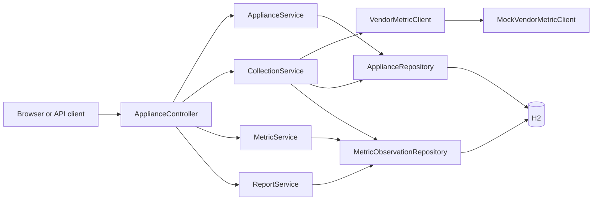
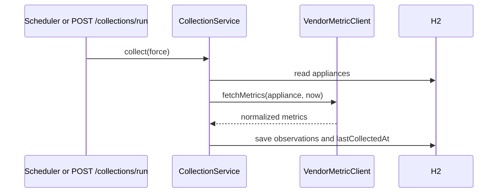

# IoT Appliance Platform: Design

## Purpose

This service provides one REST API for household appliances that may originate from different vendors. It registers appliance configuration, periodically collects normalized vendor data, retains the raw history, and provides daily or custom time-range reports.

The project intentionally uses a local H2 database and deterministic mocked vendor behavior. It is runnable without accounts, appliances, cloud resources, or credentials.

All installation, startup, testing, API usage, and end-to-end `curl` examples are in [README.md](README.md). This document explains the technical decisions, internal design, and code structure.

## Why H2 Database

H2 is an embedded relational Java database. In this service it runs in memory within the Spring Boot process through the JDBC URL `jdbc:h2:mem:appliances`.

### How H2 is used

- Spring Data JPA maps `Appliance` and `MetricObservation` Java entities to relational tables.
- H2 persists registered appliances, each collection timestamp, and every metric observation for the lifetime of the running process.
- The H2 console is enabled locally so a reviewer can inspect stored appliance and metric rows without needing a separate database tool.
- Hibernate creates or updates the local schema from the entity definitions because `spring.jpa.hibernate.ddl-auto` is set to `update`.

### Why it fits this scenario

| Advantage | Value for this take-home assignment |
|---|---|
| No infrastructure dependency | A reviewer can clone the source, start the application, and exercise historical metric collection immediately. No Docker, database server, account, or secret is required. |
| Real relational persistence behavior | The implementation uses JPA entities, repositories, relationships, timestamp filtering, and aggregation over persisted observations rather than keeping data only in application memory collections. |
| Fast startup and test isolation | Each integration test starts with an empty in-memory database and does not depend on state left by a previous run. |
| Inspectable state | The H2 web console allows direct inspection of the appliance configuration and historical observation tables during local review. |
| Portable Java dependency | H2 is a Maven runtime dependency, so it behaves consistently on supported developer machines. |

### Tradeoffs and production path

H2 is deliberately not the production persistence choice. Its in-memory mode loses data when the application stops and does not provide production-grade multi-instance availability, backup strategy, access control, or operational tooling. For production, configure Spring Data JPA with PostgreSQL or another managed relational database, use Flyway or Liquibase migrations, and disable the H2 console.

## Architecture

Collection flow:

## Data Model

`Appliance` is the configuration and scheduling state:

| Field | Meaning |
|---|---|
| `id` | Generated primary key. |
| `name`, `type`, `vendor` | Client-supplied appliance identity and integration routing data. |
| `collectionIntervalSeconds` | Minimum automatic polling gap. |
| `enabled` | Blocks any collection when false. |
| `lastCollectedAt` | Last successful collection timestamp. |

`MetricObservation` is immutable historical data in practice:

| Field | Meaning |
|---|---|
| `id` | Generated primary key. |
| `appliance` | Required many-to-one relationship to its source. |
| `collectedAt` | Timestamp selected by collection orchestration. |
| `metricName`, `metricValue`, `unit` | Normalized vendor data. |

## Complete Source Walkthrough

This walkthrough explains every handwritten source element. Java record component accessors, constructors, `equals`, `hashCode`, and `toString` are compiler-generated and therefore do not appear as handwritten methods.

### Bootstrap and configuration

- `AppliancePlatformApplication.java`: `@SpringBootApplication` enables component discovery, auto-configuration, and application startup. `@EnableScheduling` activates `@Scheduled` collection. `main` passes the application class and process arguments to `SpringApplication.run`.
- `application.yml`: selects in-memory H2, asks Hibernate to derive tables from the two entities, enables the development-only H2 console, and sets the scheduler's five-second check interval.
- `pom.xml`: declares Java 21; web, validation, JPA, and test Spring Boot starters; H2 at runtime; and the Spring Boot Maven plugin for `mvn spring-boot:run` and packaging.

### API layer

- `ApiModels.java`: groups immutable request/response records. `ApplianceRequest` declares Bean Validation: blank names, types, or vendors and intervals less than one are invalid. `ApplianceResponse.from` maps an entity to safe response fields. `MetricResponse.from` maps a stored observation. `CollectionResponse` communicates work performed. `MetricSummary` is one report aggregate. `ReportResponse` contains the queried range and summary rows.
- `ApplianceController.java`: exposes HTTP routes only. Constructor injection supplies business services. `index` returns browser-friendly route discovery. `list`, `create`, `update`, and `delete` delegate appliance lifecycle work. `collect` triggers collection with interval bypass. `metrics` asks `MetricService` for raw range data and maps it to response records. `daily` converts a date to a UTC 24-hour range. `report` delegates arbitrary-range aggregation.
- `ApiExceptionHandler.java`: `@RestControllerAdvice` handles expected application errors for every controller. `notFound` converts `NoSuchElementException` to `404`; `invalidRequest` converts invalid business arguments to `400`. Both serialize the exact message as JSON under `error`.

### Domain and persistence layer

- `Appliance.java`: is the JPA appliance table. Its no-argument constructor permits Hibernate hydration. Its public constructor initializes a new managed appliance. Getters expose persistent state. `update` replaces mutable configuration. `markCollected` updates the timestamp after observations are saved.
- `MetricObservation.java`: is the JPA history table. It stores one metric sample tied to its appliance. The protected constructor serves Hibernate; the public constructor sets every required value; getters make its fields available to API mapping and reporting.
- `ApplianceRepository.java`: inherits standard JPA create, read, update, and delete operations for `Appliance` from `JpaRepository`.
- `MetricObservationRepository.java`: inherits standard JPA operations and declares `findByCollectedAtGreaterThanEqualAndCollectedAtLessThan`. Spring Data derives SQL from that name, returning the half-open timestamp range.

### Application services

- `ApplianceService.java`: owns appliance lifecycle rules. `findAll` reads every appliance. `find` reads one or throws `NoSuchElementException` for the exception advice. `create` transforms the API request into an entity. `update` loads then modifies an existing entity; an omitted enabled value means true. `delete` confirms existence before removal.
- `MetricService.java`: owns raw historical reads. `findBetween` validates the range before executing the repository query. `@Transactional(readOnly = true)` documents that it does not mutate data and permits database optimizations.
- `CollectionService.java`: owns scheduling and persistence orchestration, not vendor implementation. `collectDueAppliances` is called by Spring at the configured fixed delay. `collect` checks enabled state and either due interval or force flag, asks the client interface for metrics, stores every observation, advances `lastCollectedAt`, and returns counts. It is transactional so one collection execution succeeds or rolls back together.
- `ReportService.java`: owns aggregation. `generate` rejects invalid ranges, loads historical samples, groups by appliance ID plus metric and unit, then builds one summary per group. `summarize` calculates count, min, max, and average with `DoubleSummaryStatistics`.

### Vendor extension point

- `VendorMetric.java`: is a normalized value object with `name`, numeric `value`, and `unit`.
- `VendorMetricClient.java`: is the abstraction used by collection. A real vendor implementation can authenticate, apply rate limits, map vendor field names, and return `VendorMetric` values without changing `CollectionService`.
- `MockVendorMetricClient.java`: is the current Spring component implementation. `fetchMetrics` derives a repeatable small variation from appliance ID and timestamp and returns metrics selected by appliance type. It makes the entire review workflow locally testable.

### Tests

- `ApplianceWorkflowIntegrationTest.java`: starts a real Spring application context and injects `MockMvc`. `rootReturnsApiDiscovery` checks browser discovery. `applianceCanBeRegisteredCollectedAndReported` verifies registration, forced collection, persistence, and aggregation. `invalidRequestsReturnClientErrors` verifies the `404` and `400` contract.

## SOLID Review and Changes

| Principle | Assessment | Result |
|---|---|---|
| Single responsibility | Controller, lifecycle, query, collection, reporting, and vendor behavior now have distinct owners. | Fixed: vendor behavior moved from `CollectionService` into `MockVendorMetricClient`; metric reads moved from controller into `MetricService`. |
| Open/closed | Collection should accept new vendor integrations without source changes. | Fixed: add a `VendorMetricClient` implementation rather than editing orchestration. |
| Liskov substitution | Any client implementing `VendorMetricClient` can replace the mock client while returning the declared normalized metric type. | Satisfied. |
| Interface segregation | The vendor boundary asks only for `fetchMetrics`; callers do not depend on authentication or transport operations they do not need. | Satisfied. |
| Dependency inversion | High-level collection depends on `VendorMetricClient`, not `MockVendorMetricClient`; HTTP handlers depend on services, not JPA repositories. | Fixed. |

Also fixed during review: missing appliance IDs now return `404`, invalid date ranges return `400`, and integration coverage asserts both behaviors.

## Assumptions and Production Next Steps

The assignment deliberately omits authentication, tenant isolation, persistent production database configuration, vendor credential storage, retries, backoff, rate limiting, distributed scheduling locks, pagination, and observability. In production, implement a separate `VendorMetricClient` for each vendor, select it by the appliance vendor field, use a durable database and migration tool, secure or remove the H2 console, and add authentication plus structured logging and metrics.

## AI Usage

AI assistance was used to scaffold, refactor, document, and validate this project. The behavior is covered by the repository's Spring Boot integration tests.