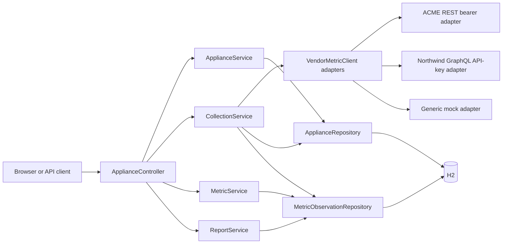
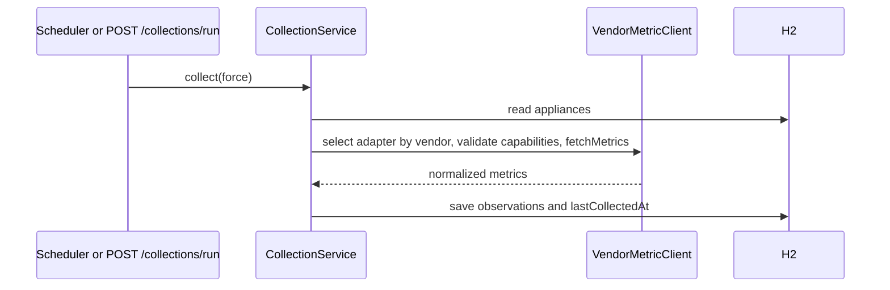

# IoT Appliance Platform: Design

## Purpose

This service provides one REST API for household appliances that may originate from different vendors. It registers appliance configuration, periodically collects normalized vendor data, retains the raw history, and provides daily or custom time-range reports.

The project intentionally uses a local H2 database and deterministic mocked vendor behavior. It is runnable without accounts, appliances, cloud resources, or credentials.

All installation, startup, testing, API usage, and end-to-end `curl` examples are in [README.md](README.md). This document explains the technical decisions, internal design, and code structure.

## Scenario Coverage

The scenario requires a consistent platform API even when appliance vendors expose incompatible API styles, credentials, device capabilities, metric names, rate limits, and reliability characteristics. The implementation models those differences at the vendor adapter boundary and exposes one appliance-management, collection, historical-data, and reporting API to clients.

| Scenario concern | Implemented behavior |
|---|---|
| Multiple connected appliances | `Appliance` stores a client-provided name, type, vendor, enabled state, and collection interval. The API supports registration, listing, replacement, and deletion. Built-in local profiles cover refrigerators, air conditioners, televisions, ovens, washers, dryers, and a generic fallback. |
| Different vendors | `CollectionService` receives all Spring `VendorMetricClient` adapters and selects the adapter whose `supports(vendor)` method matches the appliance's registered vendor. |
| Different API styles | `AcmeRestVendorMetricClient` simulates a REST response; `NorthwindGraphQlVendorMetricClient` simulates a GraphQL response. Both normalize their source payloads before returning platform metrics. |
| Authentication | ACME validates a configured bearer token. Northwind validates a configured API key. The local configuration values are deliberately non-secret simulation values; production credentials belong in a secret manager. |
| Capabilities | Every adapter returns `VendorCapabilities`: supported appliance types plus normalized metric names. Collection marks an appliance collection as failed rather than persisting data when the selected vendor does not support its appliance type. |
| Different metric names | ACME maps `temp_celsius` and `watts` to `temperature` and `power`; Northwind maps `completion` and `wattsNow` to `cycle_progress` and `power`. Persisted history and reports use only the normalized names and units. |
| Rate limits | Northwind's adapter maintains a rolling one-minute request count and rejects requests above `vendors.northwind.max-requests-per-minute`. |
| Reliability | Northwind can be configured to raise a deterministic temporary availability failure every $n$ requests. Collection isolates typed vendor failures for one appliance so others continue collecting; persistence and unexpected internal faults propagate and fail the transaction. |
| Consistent client behavior | Regardless of vendor, successful samples become `MetricObservation` records and are returned through the same raw-history, daily-report, and custom-range-report APIs. `CollectionResponse` reports successful appliances, stored samples, and failed collections. |

### Local Vendor Contract Matrix

| Vendor | Simulated source contract | Authentication | Supported appliance types | Source-to-platform metric normalization | Operational behavior |
|---|---|---|---|---|---|
| `acme` | REST-style JSON map | Bearer token | `refrigerator`, `fridge`, `air_conditioner`, `ac` | `temp_celsius` -> `temperature`; `watts` -> `power` | A blank token causes an authentication failure. |
| `northwind` | GraphQL-style result map | API key | `washer`, `washing_machine`, `dryer`, `television`, `tv` | `completion` -> `cycle_progress`; `wattsNow` -> `power` | Configurable one-minute request limit and optional deterministic temporary failures. |
| Any other vendor name | Generic local mock | None | Any local appliance type | Emits the platform metric names directly | Used to keep unintegrated vendors reviewable without external infrastructure. |

## Why H2 Database

H2 is an embedded relational Java database. In this service it runs in memory within the Spring Boot process through the JDBC URL `jdbc:h2:mem:appliances`.

### How H2 is used

- Spring Data JPA maps `Appliance` and `MetricObservation` Java entities to relational tables.
- H2 persists registered appliances, each collection timestamp, and every metric observation for the lifetime of the running process.
- The H2 console is enabled locally so a reviewer can inspect stored appliance and metric rows without needing a separate database tool.
- Hibernate creates or updates the local schema from the entity definitions because `spring.jpa.hibernate.ddl-auto` is set to `update`.

### Why it fits this scenario

| Advantage | Value for this take-home assignment |
|---|---|
| No infrastructure dependency | A reviewer can clone the source, start the application, and exercise historical metric collection immediately. No Docker, database server, account, or secret is required. |
| Real relational persistence behavior | The implementation uses JPA entities, repositories, relationships, timestamp filtering, and aggregation over persisted observations rather than keeping data only in application memory collections. |
| Fast startup and test isolation | Each integration test starts with an empty in-memory database and does not depend on state left by a previous run. |
| Inspectable state | The H2 web console allows direct inspection of the appliance configuration and historical observation tables during local review. |
| Portable Java dependency | H2 is a Maven runtime dependency, so it behaves consistently on supported developer machines. |

### Tradeoffs and production path

H2 is deliberately not the production persistence choice. Its in-memory mode loses data when the application stops and does not provide production-grade multi-instance availability, backup strategy, access control, or operational tooling. For production, configure Spring Data JPA with PostgreSQL or another managed relational database, use Flyway or Liquibase migrations, and disable the H2 console.

## Operational Readiness

The application keeps local execution friction low while moving operational concerns into environment-overridable configuration. Its default values start H2 with deterministic vendor simulations; a deployment can override database, credential, scheduler, and vendor-control values without code changes.

| Concern | Local behavior | Deployment behavior |
|---|---|---|
| Database | `DATABASE_URL` defaults to H2 in memory. | Set `DATABASE_URL`, `DATABASE_USERNAME`, and `DATABASE_PASSWORD` for PostgreSQL. The PostgreSQL JDBC driver is included at runtime. |
| Schema management | `JPA_DDL_AUTO` defaults to `update` for local review. | Set it to `validate` and apply versioned Flyway or Liquibase migrations before starting the application. |
| H2 console | `H2_CONSOLE_ENABLED` defaults to `true`. | Set it to `false`; do not expose a database console in production. |
| Vendor credentials | Environment values default to non-secret simulation strings. | Supply `ACME_BEARER_TOKEN` and `NORTHWIND_API_KEY` through a secret manager or deployment secret mechanism. |
| Collection operations | The scheduler delay and Northwind limits have local defaults. | Tune `COLLECTION_SCHEDULER_DELAY_MS` and the Northwind settings to the appliance fleet and actual vendor policy. |
| Health | Spring Boot Actuator exposes `/actuator/health`, including liveness and readiness probes. | Restrict actuator exposure at the network boundary and use the health endpoint for platform probes. |
| Collection failure visibility | A typed vendor failure increments `failedCollections`. | `CollectionService` writes a warning containing appliance ID, vendor, type, failure category, and message. It does not swallow persistence or unexpected internal failures, protecting transaction integrity. |

`spring.jpa.open-in-view` is disabled. The service therefore does not depend on an HTTP request retaining a JPA session: the historical range repository query explicitly joins and fetches the source `Appliance`, and report generation runs in a read-only transaction.

## API Signatures

All routes return JSON except `DELETE /api/appliances/{id}`, which returns an empty response body. Timestamps use ISO-8601 UTC instants, such as `2026-08-18T16:06:00Z`.

### Shared Types

| Type | Signature | Description |
|---|---|---|
| `ApplianceRequest` | `{name, type, vendor, collectionIntervalSeconds, enabled?}` | Input for appliance creation or replacement. `name`, `type`, and `vendor` must be non-blank; `collectionIntervalSeconds` must be at least `1`; `enabled` is optional. |
| `ApplianceResponse` | `{id, name, type, vendor, collectionIntervalSeconds, enabled, lastCollectedAt}` | Persisted appliance configuration. `lastCollectedAt` is `null` before the first successful collection. |
| `MetricResponse` | `{applianceId, collectedAt, metricName, value, unit}` | One raw, normalized historical observation. |
| `CollectionResponse` | `{appliancesCollected, metricsStored, failedCollections}` | Successful appliance collections, raw observations persisted, and vendor collections that failed because of authentication, unsupported capability, rate limit, or temporary availability. |
| `MetricSummary` | `{applianceId, applianceName, metricName, unit, samples, minimum, maximum, average}` | Aggregate statistics for one appliance metric. |
| `ReportResponse` | `{start, end, metrics: MetricSummary[]}` | A report's half-open time range and aggregate rows. |
| `ErrorResponse` | `{error}` | Shared error body returned for application-level `400` and `404` responses. |

### Route Contracts

| Method and path | Request signature | Success response | Error contract |
|---|---|---|---|
| `GET /` | No request body. | `200` with a service name and endpoint discovery map. | None. |
| `GET /api/appliances` | No request body. | `200` with `ApplianceResponse[]`. | None. |
| `POST /api/appliances` | `ApplianceRequest`. | `201` with `ApplianceResponse`. | `400` for invalid request fields. |
| `PUT /api/appliances/{id}` | Path `id: long`; `ApplianceRequest`. | `200` with `ApplianceResponse`. | `400` for invalid fields; `404` when `id` is unknown. |
| `DELETE /api/appliances/{id}` | Path `id: long`. | `204` with no body. | `404` when `id` is unknown. |
| `POST /api/collections/run` | No request body. | `200` with `CollectionResponse`. | None. Disabled appliances are not collected. |
| `GET /api/metrics` | Query `start: Instant`, `end: Instant`. | `200` with `MetricResponse[]`. | `400` unless $start < end$. |
| `GET /api/reports` | Query `start: Instant`, `end: Instant`. | `200` with `ReportResponse`. | `400` unless $start < end$. |
| `GET /api/reports/daily/{date}` | Path `date: LocalDate` in `YYYY-MM-DD` form. | `200` with `ReportResponse`. | `400` for an invalid date. |

### Time-Range Semantics

The raw metrics and custom report endpoints use a half-open interval: $[start, end)$. A metric is included when $start \le collectedAt < end$. This makes adjacent report windows non-overlapping, avoiding duplicate observations at the shared boundary.

The daily report endpoint translates its date into the UTC range from midnight at the start of the date to midnight at the start of the following date.

## Architecture

Collection flow:

## Data Model

`Appliance` is the configuration and scheduling state:

| Field | Meaning |
|---|---|
| `id` | Generated primary key. |
| `name`, `type`, `vendor` | Client-supplied appliance identity and integration routing data. |
| `collectionIntervalSeconds` | Minimum automatic polling gap. |
| `enabled` | Blocks any collection when false. |
| `lastCollectedAt` | Last successful collection timestamp. |

`MetricObservation` is immutable historical data in practice:

| Field | Meaning |
|---|---|
| `id` | Generated primary key. |
| `appliance` | Required many-to-one relationship to its source. |
| `collectedAt` | Timestamp selected by collection orchestration. |
| `metricName`, `metricValue`, `unit` | Normalized vendor data. |

## Complete Source Walkthrough

This walkthrough explains every handwritten source element. Java record component accessors, constructors, `equals`, `hashCode`, and `toString` are compiler-generated and therefore do not appear as handwritten methods.

### Bootstrap and configuration

- `AppliancePlatformApplication.java`: `@SpringBootApplication` enables component discovery, auto-configuration, and application startup. `@EnableScheduling` activates `@Scheduled` collection. `main` passes the application class and process arguments to `SpringApplication.run`.
- `application.yml`: supplies local H2 defaults while allowing database, schema, H2-console, scheduler, and vendor settings to be overridden by environment variables. It also configures Actuator health, liveness, and readiness probes.
- `pom.xml`: declares Java 21; web, validation, JPA, Actuator, and test Spring Boot starters; H2 and PostgreSQL drivers at runtime; and the Spring Boot Maven plugin for `mvn spring-boot:run` and packaging.

### API layer

- `ApiModels.java`: groups immutable request/response records. `ApplianceRequest` declares Bean Validation: blank names, types, or vendors and intervals less than one are invalid. `ApplianceResponse.from` maps an entity to safe response fields. `MetricResponse.from` maps a stored observation. `CollectionResponse` communicates work performed. `MetricSummary` is one report aggregate. `ReportResponse` contains the queried range and summary rows.
- `ApplianceController.java`: exposes HTTP routes only. Constructor injection supplies business services. `index` returns browser-friendly route discovery. `list`, `create`, `update`, and `delete` delegate appliance lifecycle work. `collect` triggers collection with interval bypass. `metrics` asks `MetricService` for raw range data and maps it to response records. `daily` converts a date to a UTC 24-hour range. `report` delegates arbitrary-range aggregation.
- `ApiExceptionHandler.java`: `@RestControllerAdvice` handles expected application errors for every controller. `notFound` converts `NoSuchElementException` to `404`; `invalidRequest` converts invalid business arguments to `400`. Both serialize the exact message as JSON under `error`.

### Domain and persistence layer

- `Appliance.java`: is the JPA appliance table. Its no-argument constructor permits Hibernate hydration. Its public constructor initializes a new managed appliance. Getters expose persistent state. `update` replaces mutable configuration. `markCollected` updates the timestamp after observations are saved.
- `MetricObservation.java`: is the JPA history table. It stores one metric sample tied to its appliance. The protected constructor serves Hibernate; the public constructor sets every required value; getters make its fields available to API mapping and reporting.
- `ApplianceRepository.java`: inherits standard JPA create, read, update, and delete operations for `Appliance` from `JpaRepository`.
- `MetricObservationRepository.java`: inherits standard JPA operations and declares `findByCollectedAtGreaterThanEqualAndCollectedAtLessThan`. Its JPQL query applies the half-open timestamp range and `join fetch`es the source appliance, avoiding lazy-loading failures after the repository call. `MetricObservation` adds an index on `collectedAt` for range reads.

### Application services

- `ApplianceService.java`: owns appliance lifecycle rules. `findAll` reads every appliance. `find` reads one or throws `NoSuchElementException` for the exception advice. `create` transforms the API request into an entity. `update` loads then modifies an existing entity; an omitted enabled value means true. `delete` confirms existence before removal.
- `MetricService.java`: owns raw historical reads. `findBetween` validates the range before executing the repository query. `@Transactional(readOnly = true)` documents that it does not mutate data and permits database optimizations.
- `CollectionService.java`: owns scheduling and persistence orchestration, not vendor implementation. `collectDueAppliances` is called by Spring at the configured fixed delay. `collect` checks enabled state and either due interval or force flag, selects the matching vendor client, validates its capabilities, stores normalized observations, advances `lastCollectedAt` after a successful collection, and returns successful, stored, and failed counts. It isolates only typed `VendorIntegrationException` categories (`AUTHENTICATION`, `CAPABILITY`, `RATE_LIMIT`, and `TEMPORARY_UNAVAILABLE`) per appliance and logs each one with context. Persistence and other unexpected failures propagate, preventing a corrupted transaction from being reported as a vendor failure.
- `ReportService.java`: owns aggregation. `generate` is read-only transactional, rejects invalid ranges, loads historical samples, groups by appliance ID plus metric and unit, then builds one summary per group. `summarize` calculates count, min, max, and average with `DoubleSummaryStatistics`.

### Vendor extension point

- `VendorMetric.java`: is a normalized value object with `name`, numeric `value`, and `unit`.
- `VendorMetricClient.java`: is the abstraction used by collection. Each adapter declares vendor selection and `VendorCapabilities`, then returns normalized `VendorMetric` values.
- `VendorCapabilities.java`: declares the appliance types and normalized metrics supported by an adapter. Collection rejects unsupported vendor/type combinations before persisting samples.
- `AcmeRestVendorMetricClient.java`: simulates ACME's bearer-authenticated REST payload, then maps `temp_celsius` and `watts` to the platform's `temperature` and `power` names.
- `NorthwindGraphQlVendorMetricClient.java`: simulates Northwind's API-key-authenticated GraphQL payload, normalizes `completion` and `wattsNow`, enforces a configurable per-minute allowance, and can produce deterministic transient availability errors.
- `MockVendorMetricClient.java`: supplies a credential-free generic fallback for vendor names other than ACME and Northwind, making unintegrated vendors locally reviewable.
- `VendorIntegrationException.java`: identifies and classifies expected vendor authentication, capability, rate-limit, and temporary-availability failures so collection can isolate them without suppressing persistence faults.

### Tests

- `ApplianceWorkflowIntegrationTest.java`: starts a real Spring application context and injects `MockMvc`. `rootReturnsApiDiscovery` checks browser discovery. `applianceCanBeRegisteredCollectedAndReported` verifies registration, forced collection, persistence, and aggregation. `invalidRequestsReturnClientErrors` verifies the `404` and `400` contract.
- `MockVendorMetricClientTest.java`: verifies the type-specific local mock profiles for television, oven, washer, and dryer.
- `VendorIntegrationClientTest.java`: verifies ACME bearer authentication and REST field normalization, plus Northwind API-key handling, capability declaration, GraphQL field normalization, rate limiting, and temporary availability failures.

## SOLID Review and Changes

| Principle | Assessment | Result |
|---|---|---|
| Single responsibility | Controller, lifecycle, query, collection, reporting, and vendor behavior now have distinct owners. | Fixed: vendor behavior moved from `CollectionService` into vendor-specific `VendorMetricClient` adapters; metric reads moved from controller into `MetricService`. |
| Open/closed | Collection should accept new vendor integrations without source changes. | Fixed: add a `VendorMetricClient` implementation rather than editing orchestration. |
| Liskov substitution | Any client implementing `VendorMetricClient` can replace the mock client while returning the declared normalized metric type. | Satisfied. |
| Interface segregation | The vendor boundary asks only for vendor selection, declared capabilities, and normalized metric retrieval; callers do not depend on authentication or transport-specific operations. | Satisfied. |
| Dependency inversion | High-level collection depends on `VendorMetricClient`, not `MockVendorMetricClient`; HTTP handlers depend on services, not JPA repositories. | Fixed. |

Also fixed during review: missing appliance IDs now return `404`, invalid date ranges return `400`, and integration coverage asserts both behaviors.

## Assumptions and Production Next Steps

The assignment deliberately uses simulated vendor credentials, rate limits, and temporary failures instead of live integrations. It also omits tenant isolation, persistent production database configuration, secret-manager integration, durable retries and backoff, distributed scheduling locks, pagination, and observability. In production, replace each simulated adapter with a vendor-specific HTTP client, keep credentials in a secret manager, implement bounded retries and backoff for transient vendor errors, use a durable database and migration tool, secure or remove the H2 console, and add authentication plus structured logging and metrics.

## AI Usage

AI assistance was used to scaffold, refactor, document, and validate this project. The behavior is covered by the repository's Spring Boot integration tests.